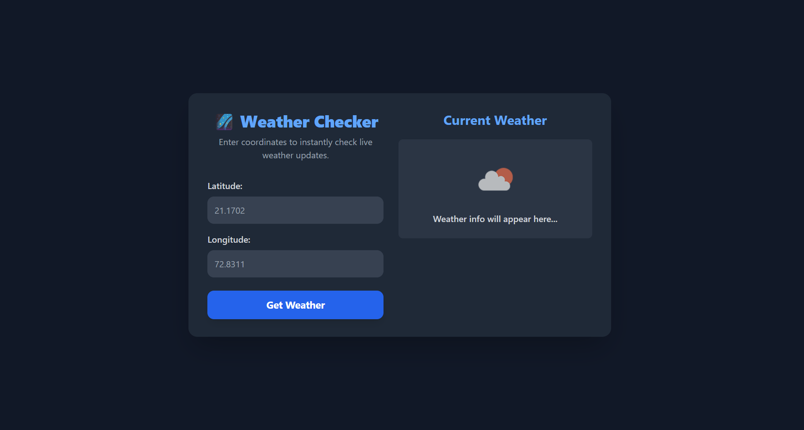
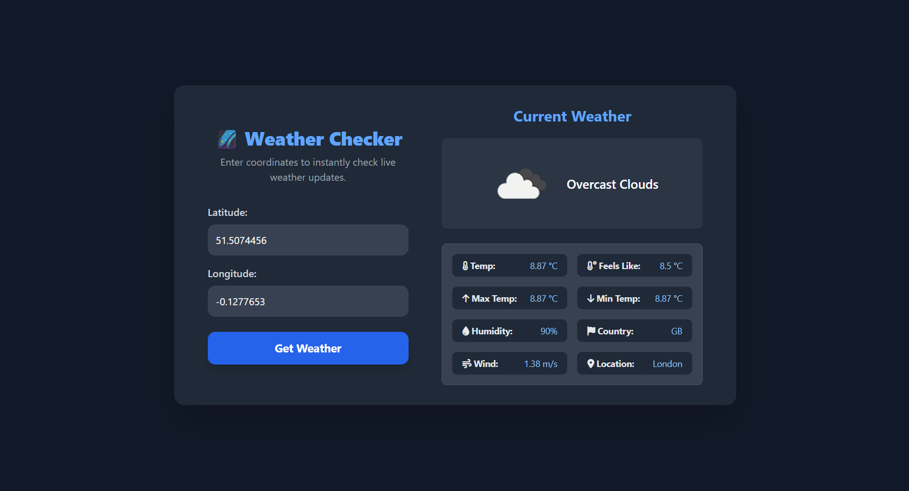

# 🌌 Dark Weather App

A sleek and responsive **Weather Application** built with **HTML**, **TailwindCSS**, and **JavaScript**.  
Easily check **live weather updates** by entering **Latitude & Longitude**, powered by the **OpenWeatherMap API**.  

---

## ✨ Features
✅ Search weather by **Latitude & Longitude**  
✅ Beautiful **Dark UI** with TailwindCSS  
✅ **Loading Spinner** while fetching data  
✅ Shows detailed weather information:  
   - 🌡️ Current Temperature  
   - 🤒 Feels Like  
   - 🔺 Max & 🔻 Min Temperature  
   - 💧 Humidity  
   - 🌬️ Wind Speed  
   - 🏳️ Country  
   - 📍 City / Location  
✅ Displays **weather icon + description**  
✅ Fully **Responsive** (Mobile & Desktop)  

---

## 📸 Screenshots

### 🔹 Input & Default View


### 🔹 Weather Results


---

## 🛠️ Tech Stack
- ⚡ **HTML5**  
- 🎨 **Tailwind CSS** (UI styling)  
- 🔥 **JavaScript (Vanilla)** (API integration & DOM updates)  
- 🖼️ **FontAwesome** (icons)  
- ☁️ **OpenWeatherMap API** (live weather data)  

---

## ⚙️ Installation & Setup

### 1️⃣ Add Your API Key
Open `script.js` and replace with your own OpenWeatherMap API Key:

```javascript
const apiKey = "YOUR_API_KEY";
```

### 2️⃣ Run the Project
Simply open index.html in your browser 🎉

🔑 API Key Setup

#### Sign up at OpenWeatherMap

- Generate a free API key
- Replace the placeholder in script.js

### 📂 Project Structure

dark-weather-app/ <br>
│── index.html        # Main HTML structure <br>
│── script.js         # JavaScript (API + UI logic) <br>
│── README.md         # Documentation <br>
│── screenshots/      # App screenshots <br>


### 👨‍💻 Author
Developed with ❤️ by Sahil Master