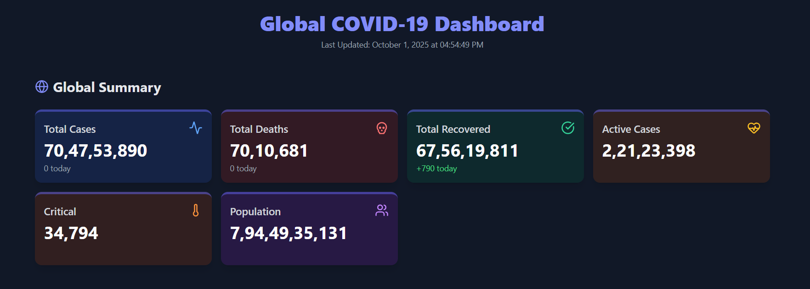
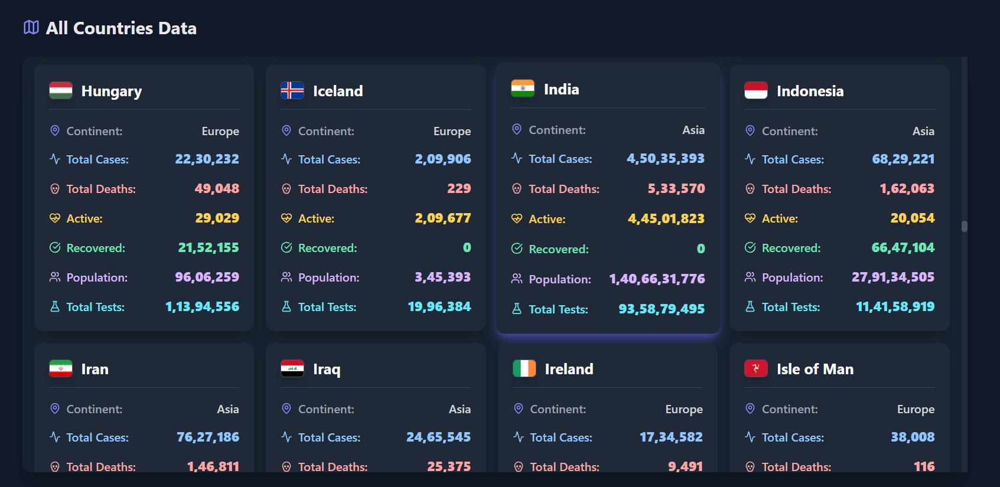

# 🌍 Global COVID-19 Tracker

A modern and responsive **Global COVID-19 Dashboard** built with **HTML**, **Tailwind CSS**, and **JavaScript**.  
It displays **global stats** and **country-wise data** for COVID-19 in a **card-based UI** with interactive icons using **Lucide Icons**.

---

## 🔗 Live Demo

You can run this project locally by opening `index.html` in your browser.  
No backend setup is required since it fetches data directly from the **[disease.sh API](https://disease.sh/)**.

---

## 🛠️ Technologies Used

- **HTML5 & CSS3**
- **Tailwind CSS** – For modern and responsive styling
- **JavaScript (ES6+)** – Fetch API, DOM Manipulation
- **Lucide Icons** – For professional-looking icons
- **disease.sh API** – Free COVID-19 data API

---

## 💡 Features

- **Global Summary Dashboard**
  - Total Cases, Deaths, Recovered, Active Cases, Critical, and Population
  - Shows **today's cases and deaths** dynamically
  - Responsive grid layout with **hover animations**
- **Country-wise Data**
  - Flag, continent, total cases, deaths, recovered, active cases, population, and total tests
  - Scrollable card layout with **custom scrollbar**
- **Interactive UI**
  - Hover effects and subtle animations
  - Professional iconography with Lucide Icons
- **Error Handling**
  - Displays a message if fetching global or country data fails
- **Responsive Design**
  - Works on mobile, tablet, and desktop devices

---

## 📸 Screenshot

  
  

---

## ⚡ How to Use

1. Clone My repository:

```bash
git clone https://github.com/masterSahil/JS-Projects.git
```

2. Navigate to the project folder:

```
cd 11.Corona
```

3. Open index.html in your favorite browser:

```
open index.html
# or simply double-click the file in your file explorer
```

---

## 🔧 File Structure

global-covid-tracker/ <br>
│ <br>
├── index.html            # Main HTML file <br>
├── assets/ <br>
│   └── script.js         # JavaScript logic for fetching and rendering data <br>
│   └── imgs              # App screenshot
└── README.md             # Project documentation <br>

---

## ⚠️ Notes

- Ensure you have a stable internet connection as the app fetches data from the external API.
- The API used is free and publicly available: https://disease.sh

## 📚 References

- Tailwind CSS Documentation
- Lucide Icons Documentation
- disease.sh COVID-19 API

## 👨‍💻 Author
Sahil Master