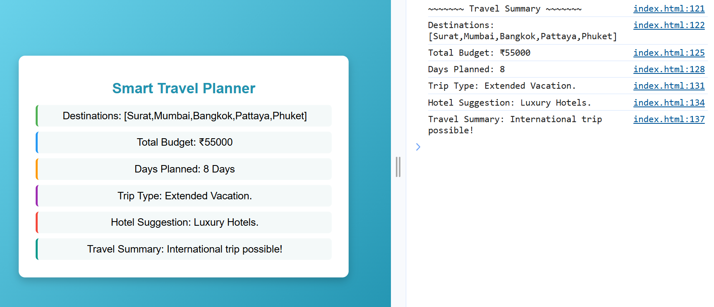

# 🧳 Smart Travel Planner  

A simple yet interactive **travel planning web app** built using **HTML, CSS, and JavaScript**.  
The app helps users plan their trips by collecting information such as destinations, budget, and days of travel.  
Based on the inputs, it suggests the **trip type, hotel recommendations, and travel summary**.  

---

## 🚀 Features
- ✨ Enter multiple travel destinations.  
- 💰 Budget-based trip suggestions (short domestic, long domestic, or international).  
- 📅 Travel duration categorization (weekend, holiday, or extended vacation).  
- 🏨 Smart hotel suggestions based on per-day budget.  
- 🎨 Clean and modern UI with gradient background and hover effects.  
- 📊 Displays all results neatly inside a styled card container.  

---

## 🛠️ Technologies Used
- **HTML5** → Structure of the app  
- **CSS3** → Styling, gradients, shadows, hover effects  
- **JavaScript (ES6)** → Dynamic logic, user prompts, and data rendering  

---

## 📸 Screenshot

---

## 📂 How to Run
1. Clone or download this repository.  
2. Open the `index.html` file in your browser.  
3. Follow the prompts to enter destinations, budget, and days.  
4. View your personalized travel summary in the web interface.  

---

## 📌 Example Flow
1. User enters **3 destinations**.  
2. Sets a **budget of ₹25,000**.  
3. Chooses **5 days** for travel.  
4. App outputs:  
   - Trip Type → Perfect Holiday Trip.  
   - Hotel Suggestion → Mid-range Hotels.  
   - Travel Summary → You can plan a long domestic trip.  

---

## 👤 Owner & Creator
Made with ❤️ and passion by **Sahil Master** ✨  