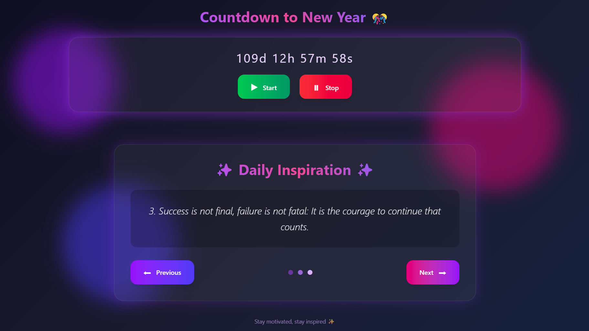
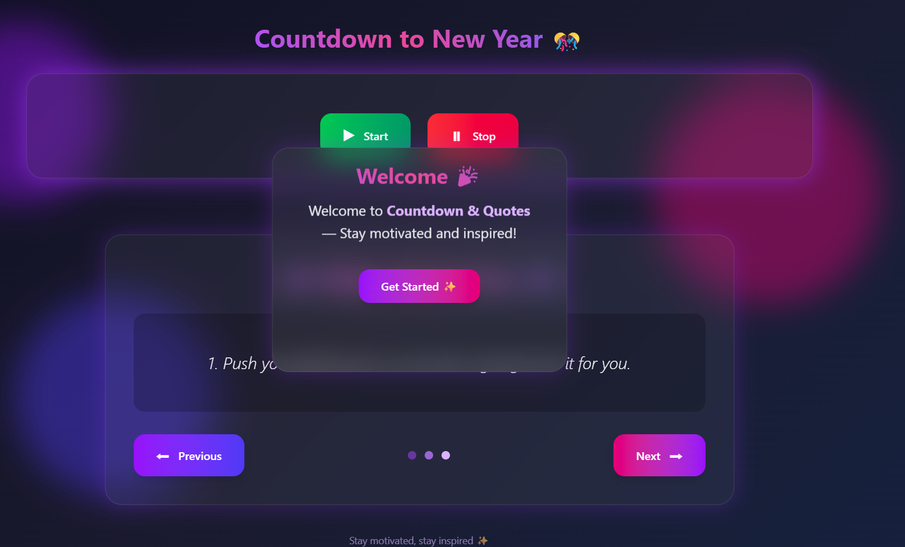

# Countdown & Quotes — README

**A compact, stylish web app that shows a countdown to a target date (New Year by default) and a rotating set of motivational quotes.**

---

## Table of contents

* Overview
* Features
* Tech stack
* Project structure
* Quick start (run locally)
* How it works — in depth

  * Modal popup
  * Quotes slider
  * Countdown logic
* Customization and configuration
* Accessibility & UX improvements
* Performance & best practices
* Troubleshooting & known issues
* Deployment
* Contributing
* License

---

# Overview

This project is a small, single-page web app that combines a countdown timer and a motivational quotes carousel. It uses minimal dependencies (Tailwind via CDN for utilities plus custom CSS) and plain JavaScript to keep the UX snappy and the code easy to understand.

The UI emphasizes a glassmorphism / neon aesthetic with gentle animations and responsive layout so it looks good on desktop and mobile.

---

# Features

* Countdown to a configurable target date (default: New Year 2026).
* Start / Stop controls for the countdown.
* Modal welcome popup that appears after a short delay.
* Quotes carousel with manual (Prev / Next) and automatic sliding.
* Smooth CSS animations and a glass-effect UI.
* Small, dependency-free JavaScript logic (no frameworks required).

---

# Tech stack

* HTML5 + CSS3
* Tailwind CSS (via CDN) for quick utility classes
* Vanilla JavaScript (ES6)

No build tooling is required — files can be opened directly in the browser or served with a static web server.

---

# Project structure

```
countdown-quotes/
├─ index.html        # Main page (contains markup & inline styles in the sample)
├─ script.js         # JavaScript logic: modal, quotes, countdown
├─ README.md         # This file
└─ assets/           # Optional: images, favicons, fonts, etc.
```

> Note: In the provided sample the styling is inline inside the HTML `<head>`. For a production project move styles to a separate stylesheet (styles.css) and import Tailwind via a bundler or CDN as appropriate.

---

# Quick start (run locally)

1. Clone or download the repository into a folder.
2. Open `index.html` in your browser. (Double-click or serve via a static server.)

To serve the folder with a simple HTTP server (recommended, some browsers block `file://` requests for modules):

```bash
# Python 3 (simple)
python -m http.server 8000
# then open http://localhost:8000 in your browser

# or using npm package 'serve'
npx serve .
```

---

# How it works — in depth

Below is a component-level walkthrough of the JavaScript logic included in `script.js`.

## Modal popup

* The modal element is hidden initially via `display: none` in the script:

```js
// Display Popup (initially hidden)
document.getElementById("modal").style.display = "none";

setTimeout(() => {
  document.getElementById("modal").style.display = "block";
}, 5000);

function closePopup() {
  document.getElementById("modal").style.display = "none";
}
```

**Why this works:** the modal is explicitly hidden when the script runs and then shown after 5 seconds by toggling `display`. This provides a lightweight welcome animation without heavy libraries.

**Accessibility note:** the sample toggles `display`, but does not trap focus or set `aria-modal` attributes. See the *Accessibility* section for concrete improvements.

## Quotes slider

* The quotes are stored in an array (simple strings). The script exposes `next()` and `prev()` functions that update an index `i` and write the current quote to the DOM.

```js
const qoutes = [
  " 1. Push yourself, because no one else is going to do it for you.",
  " 2. The harder you work for something, the greater you’ll feel when you achieve it.",
  // ...
];
let i = 0;
document.querySelector('#qoute-para').innerHTML = qoutes[i];

function autoSlideQoutes() {
  i = (i + 1) % qoutes.length;
  document.querySelector('#qoute-para').innerHTML = qoutes[i];
}
setInterval(autoSlideQoutes, 4000);
```

**Notes & improvements:**

* The sample uses string-only quotes; to support authors and richer layout switch to an array of objects, e.g. `{ text: '...', author: '— Author' }` and render accordingly.
* The DOM id `qoute-para` (and the variable `qoutes`) contains a typo. It's functional because the code uses the same name, but renaming to `quote-para` and `quotes` improves readability.
* Use `clearInterval` when the user navigates away or when the carousel is paused.
* For performance, pause the carousel using the Page Visibility API when the tab is hidden.

## Countdown logic

* The countdown uses a target timestamp and a one-second interval to update the days, hours, minutes, and seconds left.

Key functions:

```js
const targetDate = new Date("Jan 1, 2026 00:00:00").getTime();
let countdownInterval;

function updateCountdown() {
  const now = Date.now();
  const distance = targetDate - now;

  if (distance <= 0) {
    document.getElementById("countdown").innerHTML = "🎉 Happy New Year!";
    clearInterval(countdownInterval);
    return;
  }

  const days = Math.floor(distance / (1000 * 60 * 60 * 24));
  const hours = Math.floor((distance % (1000 * 60 * 60 * 24)) / (1000 * 60 * 60));
  const minutes = Math.floor((distance % (1000 * 60 * 60)) / (1000 * 60));
  const seconds = Math.floor((distance % (1000 * 60)) / 1000);

  document.getElementById("countdown").textContent = `${days}d ${hours}h ${minutes}m ${seconds}s`;
}

function startCountdown() {
  if (!countdownInterval) {
    updateCountdown();
    countdownInterval = setInterval(updateCountdown, 1000);
  }
}

function stopCountdown() {
  clearInterval(countdownInterval);
  countdownInterval = null;
}
```

**Important details**:

* The `targetDate` string is parsed by the browser and interpreted in the local timezone. If you need consistent behaviour across timezones use an ISO `Z` timestamp (UTC), e.g. `new Date('2026-01-01T00:00:00Z')` or `Date.UTC(2026, 0, 1)`.
* `startCountdown()` prevents creating multiple intervals by checking whether `countdownInterval` is set. This avoids accelerated countdowns from repeated clicks.

---

# Customization & configuration

Here are common and useful ways to customize the app.

### Change the target date (example: custom date picker)

Replace the `targetDate` constant with a value parsed from user input.

```js
// Example: using an <input type="datetime-local" id="targetPicker">
const input = document.getElementById('targetPicker');
input.addEventListener('change', () => {
  const iso = input.value; // example: '2025-12-31T23:59'
  targetDate = new Date(iso).getTime();
  startCountdown();
});
```

### Use quote objects (text + author)

```js
const quotes = [
  { text: 'Push yourself...', author: 'Unknown' },
  { text: 'The harder you work...', author: 'Unknown' },
];

function renderQuote(idx) {
  const q = quotes[idx];
  document.getElementById('quote-para').innerHTML = `<p>"${q.text}"</p><footer>— ${q.author}</footer>`;
}
```

### Pause the carousel when tab is hidden

```js
document.addEventListener('visibilitychange', () => {
  if (document.hidden) clearInterval(sliderInterval);
  else sliderInterval = setInterval(autoSlideQoutes, 4000);
});
```

---

# Accessibility & UX improvements (recommended)

* **Modal focus management:** When the modal opens, move focus to the first focusable element inside it (the close button). Trap focus inside the dialog while open and restore focus on close.
* **Keyboard controls:** Allow `Enter` / `Space` on buttons and `Escape` to close the modal.
* **ARIA:** Add `role="dialog"`, `aria-modal="true"`, and `aria-labelledby`/`aria-describedby` to the modal.
* **Live regions:** Add `aria-live="polite"` to the countdown container so screen readers announce updates.
* **Prefers-reduced-motion:** Respect `@media (prefers-reduced-motion: reduce)` by disabling non-essential animations.
* **Contrast:** Make sure text on blurry backgrounds meets contrast guidelines (WCAG 2.1).

**Sample: close modal on Escape key**

```js
document.addEventListener('keydown', (e) => {
  if (e.key === 'Escape') closePopup();
});
```

---

# Performance & best practices

* **Throttle/ Pause:** Pause the quotes carousel when the tab is hidden or when the component is scrolled off-screen (IntersectionObserver) to reduce CPU usage.
* **Reduce interval precision:** The countdown changes only every second, so `setInterval(1000)` is sufficient and efficient.
* **Minimize repainting:** Use `textContent` not `innerHTML` when inserting plain text to avoid unnecessary HTML parsing.
* **Move large CSS to external file** and load it with `rel=preload` if needed for faster first render.

---
# Contributing

Contributions are welcome! Typical contributions:

* Accessibility fixes (focus management, ARIA attributes)
* Improve animations to respect `prefers-reduced-motion`
* Add unit tests or E2E tests
* Add a build setup using PostCSS/Tailwind proper configuration

Please open an issue describing the improvement and a pull request with clear intent and a short description of changes.

---

# Program Screenshot

### 🎯 Main Output  


### 🛠️ Popup Output  


## Author

Created by **Sahil Master**