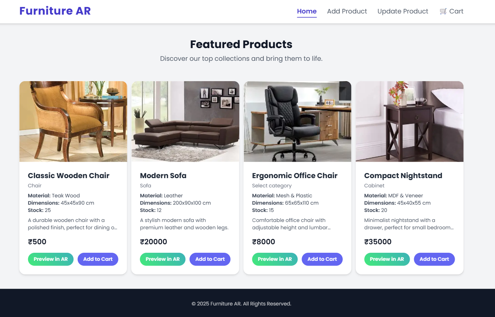
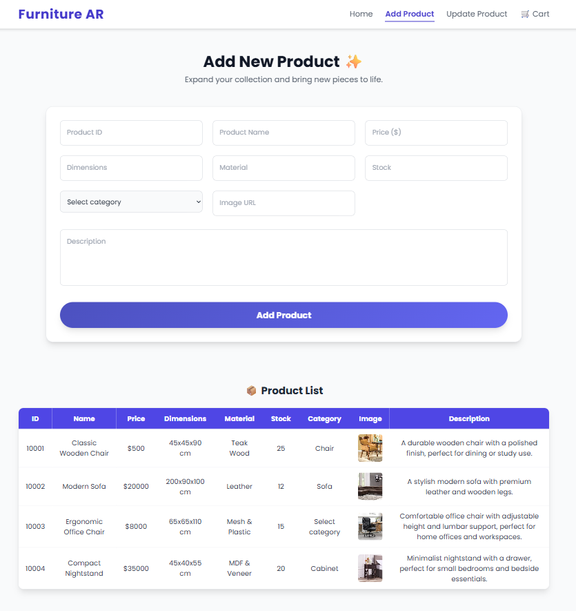
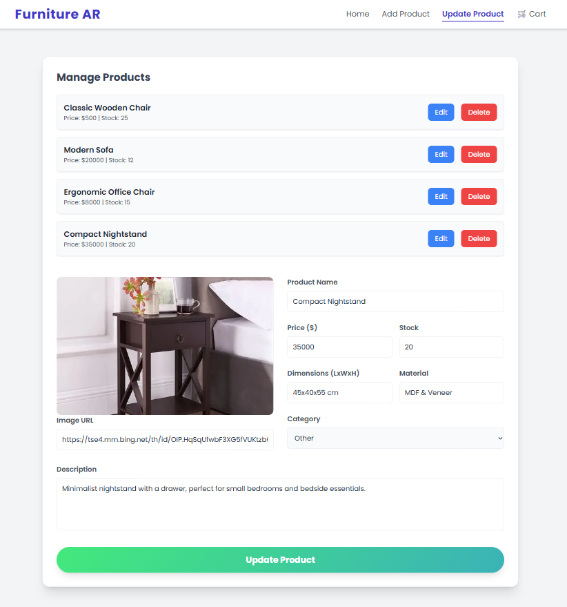
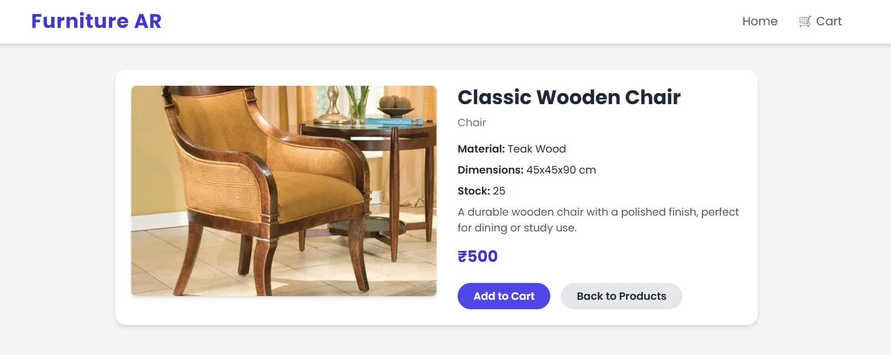
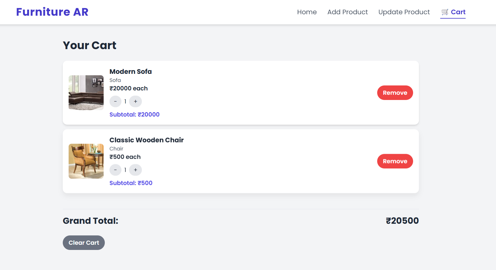

# 🛋️ Furniture AR – LocalStorage Based Store

Furniture AR is a lightweight furniture store web app built using HTML, Tailwind CSS, and Vanilla JavaScript, where products are managed completely with LocalStorage.

It supports:

✅ Adding products with details (name, price, stock, material, dimensions, description, category, image).  
✅ Updating and deleting existing products.  
✅ Previewing product details before purchase.  
✅ Managing a cart (with quantity and persistence across reloads).  
✅ Modern, responsive UI with Tailwind CSS.

## 🚀 Features

### 🔹 Add Product Page (`add.html`)
- User can add new furniture products.
- Inputs include image, product name, price, stock, dimensions, material, category, description.
- Data is saved in LocalStorage under `furnitureData`.
- Displays all added products in a table with live rendering.

### 🔹 Update Product Page (`update.html`)
- Displays a list of all saved products.
- Each product has **Edit** and **Delete** buttons.
- Edit opens a prefilled form with existing product details.
- Changes are saved back into LocalStorage.
- Delete removes the product from storage and refreshes the list.

### 🔹 Product Preview Page (`preview.html`)
- Shows a single product’s details beautifully:
  - Image
  - Product Name, Price, Category
  - Material, Dimensions, Stock
  - Full Description
- Has **Add to Cart** and **Back to Products** buttons.
- Product preview is stored in LocalStorage under `previewProduct`.

### 🔹 Cart Page (`cart.html`)
- Shows all products added to the cart.
- Uses LocalStorage under the key `cart`.
- Each cart item shows name, image, price, quantity, and total.
- Prevents duplicate items (alerts if already added).
- Quantity management supported.

### 🔹 Home Page (`index.html`)
- Displays all available furniture products.
- Products are fetched from LocalStorage.
- Clicking a product opens the Preview Page for detailed view.

## 🛠️ Tech Stack

- **Frontend**: HTML5, CSS3, Tailwind CSS
- **JavaScript**: Vanilla JS (no frameworks)
- **Storage**: Browser LocalStorage (no backend required)

## 📦 Folder Structure

```plaintext
furniture-ar
 ┣ 📜 index.html         # Home page (all products)
 ┣ 📜 add.html           # Add new product
 ┣ 📜 update.html        # Update & manage products
 ┣ 📜 preview.html       # Preview single product
 ┣ 📜 cart.html          # Cart management
 ┣ 📜 README.md          # Documentation
 ┣ 📂 assets/            # (Optional) store page images/screenshots
 ```


## ⚡ How It Works

### Adding Products
- User fills in the "Add Product" form.
- Product is pushed into LocalStorage as `furnitureData`.

### Managing Products
- On `update.html`, products are listed dynamically.
- **Edit** → Updates the object in LocalStorage.
- **Delete** → Removes the object from LocalStorage.

### Previewing a Product
- On Home, clicking a product stores it as `previewProduct` in LocalStorage.
- On `preview.html`, details are loaded and displayed.

### Cart System
- When the user adds a product → it’s stored in `cart` in LocalStorage.
- Prevents duplicates by checking product name.
- Quantity defaults to 1.

## 📸 Screenshots

- **Home Page**
    

- **Add Product Page**
    

- **Update Product Page**
    

- **Preview Page**
    

- **Cart Page**
    

## 👨‍💻 Author
Built with ❤️ by Master Sahil