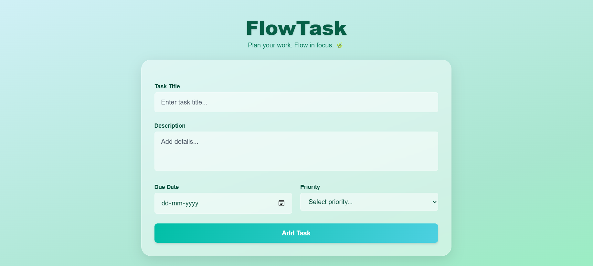
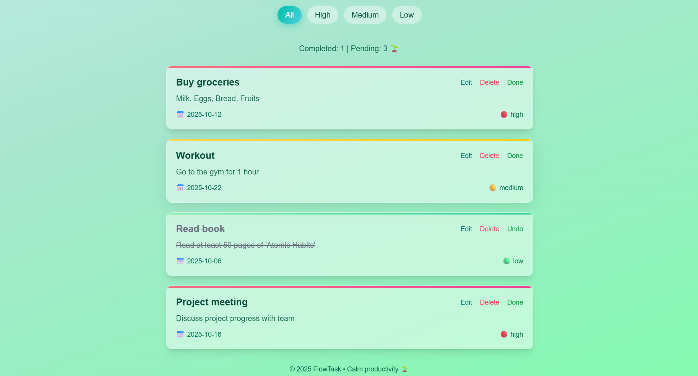

# FlowTask — Focus with Ease 🌱

FlowTask is a lightweight, visually appealing **task management web app** built with **HTML, Tailwind CSS, and JavaScript**. It helps users **plan, prioritize, and track tasks** efficiently with a calm, nature-inspired theme.

---

## Features

- **Add Tasks** – Quickly create new tasks with:
  - Title
  - Description
  - Due date
  - Priority (High, Medium, Low)

- **Edit & Delete Tasks** – Update existing tasks or remove completed/unnecessary tasks.

- **Mark as Completed** – Toggle tasks between completed and pending.

- **Filter Tasks** – Filter tasks by priority (All, High, Medium, Low).

- **Progress Tracker** – Shows **Completed vs Pending tasks** dynamically.

- **Persistent Storage** – Tasks are saved in the browser’s **LocalStorage**, so they persist across page reloads.

- **Responsive Design** – Works well on desktop and mobile.

- **Modern UI** – Glassmorphism, smooth animations, and gradient buttons for an attractive look.

---

## Demo Tasks

The app comes with some **preloaded demo tasks** for testing:

```js
[
    {
        id: 1,
        title: "Buy groceries",
        description: "Milk, Eggs, Bread, Fruits",
        dueDate: "2025-10-12",
        priority: "high",
        completed: false
    },
    {
        id: 2,
        title: "Workout",
        description: "Go to the gym for 1 hour",
        dueDate: "2025-10-10",
        priority: "medium",
        completed: true
    },
    {
        id: 3,
        title: "Read book",
        description: "Read at least 50 pages of 'Atomic Habits'",
        dueDate: "2025-10-15",
        priority: "low",
        completed: false
    },
    {
        id: 4,
        title: "Project meeting",
        description: "Discuss project progress with team",
        dueDate: "2025-10-09",
        priority: "high",
        completed: true
    },
    {
        id: 5,
        title: "Clean room",
        description: "Organize desk and closet",
        dueDate: "2025-10-11",
        priority: "medium",
        completed: false
    }
]
```

### Usage

-> Fill in the task title, description, due date, and priority in the form. <br>
-> Click Add Task to save the task. <br>
-> Use Edit or Delete buttons to manage existing tasks. <br>
-> Click the priority filters (All, High, Medium, Low) to filter tasks. <br>
-> Mark tasks as Completed/Pending using the Done/Undo button. <br>
-> View progress at the top (Completed vs Pending). <br>

### Technologies Used

-> HTML5 <br>
-> Tailwind CSS <br>
-> Vanilla JavaScript <br>
-> LocalStorage for data persistence <br>

### Screenshots
 
 

### Author
Sahil Master <br>
Calm productivity enthusiast 🌱 <br>